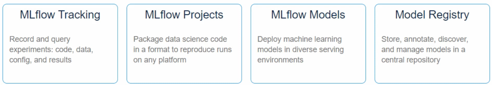
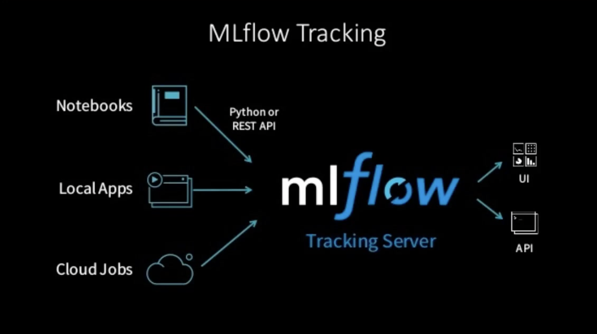
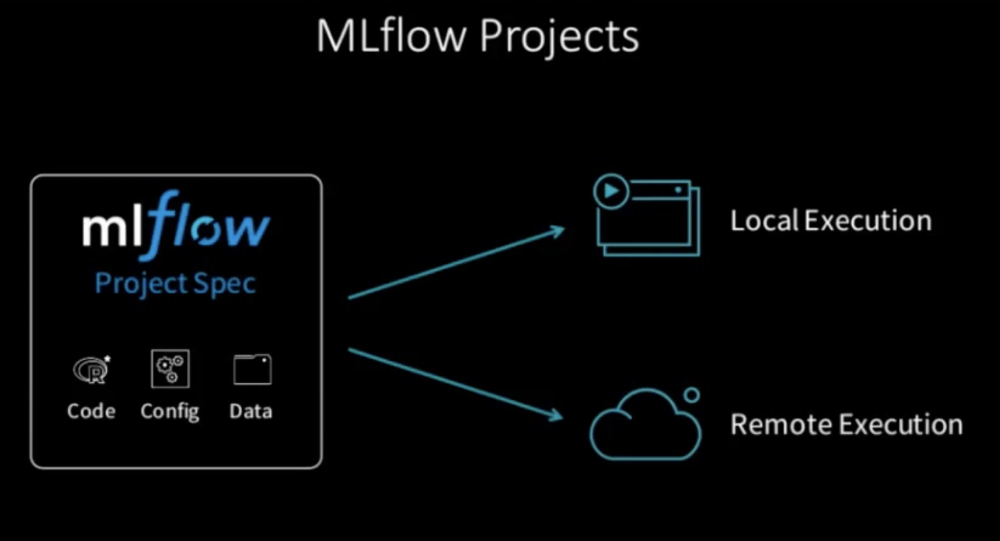
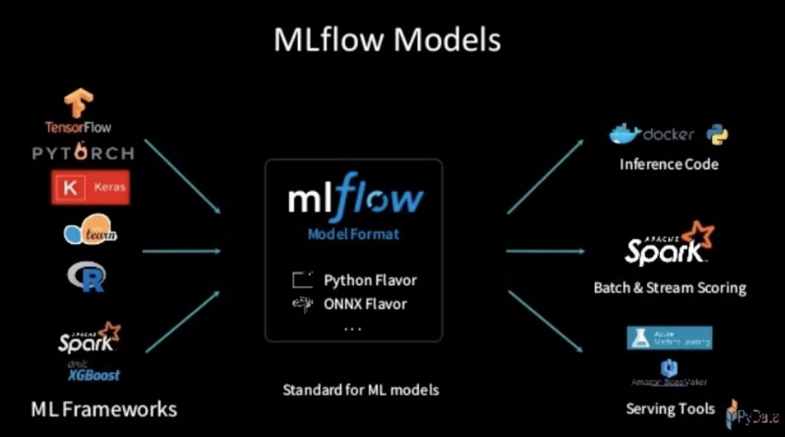
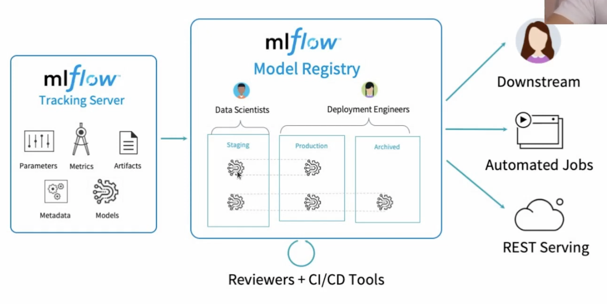

# MLflow

## What is MLflow?
- End to end MLflow pipeline
- Lightweight and very flexible

## Components of MLflow

### MLflow Tracking

- Keep track of: 
    -   Parameter and metric
    -   Track ML framework
    -   All of your code, project and model
    -   Model version

### MLflow Projects

- Containerize/package your ML project
- Very similar to Docker; encapsulating so that it can run on any machine

### MLflow Models

- Similar to projects
- You containerize a ML model
- Any framework can be used
- Two ways of loading your model - as python function or using the ML framework you have chosen

### Model Registry

- Where you can actually deploy your model
- Staging etc. environments
- You can create REST APIs to serve your model
- Can automate jobs

## Questions?
- How does MLflow talk to a DB?
- How does the MLflow model registry work and where does the data persist?
- How to run MLflow on K8s?

## Useful Resources
[Awesome playlist on MLflow components](https://www.youtube.com/watch?v=7TPHJUW9xFo&list=PL6qNEZP_yH2mnbtwmvjuL6EmWhcPyaVlg&ab_channel=IsaacReisIsaacReis)

[Code associated with the above playlist](https://github.com/Isaac4real/MLflow_Experiment)

[Intro to MLflow](https://www.youtube.com/watch?v=6uZcWqsZ2L4&ab_channel=Databricks)

[MLflow at company scale](https://databricks.com/session_eu20/mlflow-at-company-scale)

[MLflow with Postgres and systemd](https://towardsdatascience.com/setup-mlflow-in-production-d72aecde7fef)
