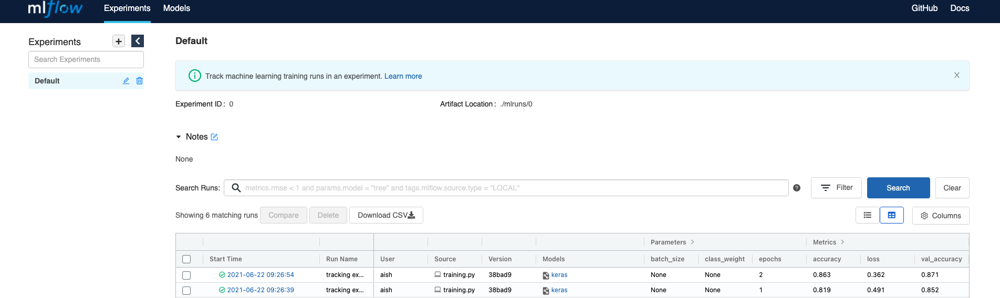

## What is MLflow?
- End to end MLflow pipeline for MLOps
- Lightweight and very flexible

### Things you can do with MLflow
- Track experiments
- Compare models on metrics, parameters etc.
- Reproduce someone else's experiments

## Components of MLflow


## [MLflow Tracking](https://www.mlflow.org/docs/latest/tracking.html)

- Keep track of: 
    -   Parameter and metric
    -   Track ML framework
    -   All of your code, project and model
    -   Model version

### Simple MLflow tracking example using TF mlflow.tensorflow.autolog()
- Create a vitrual environment and activate it
- Install the packages in requirements.txt
- Run `python src/tf_training.py` (pay attention to lines 26 and 27 in training.py)
```
...

def run_model(params):
  with mlflow.start_run(run_name="tracking experiment") as run:
    mlflow.tensorflow.autolog()
    # number of classes
    K = len(set(y_train))
    print("number of classes:", K)
    # Build the model using the functional API
    i = Input(shape=x_train[0].shape)
    x = Conv2D(32, params['convSize'], strides=2, activation='relu')(i)
    x = Conv2D(64, params['convSize'], strides=2, activation='relu')(x)
    x = Conv2D(128, params['convSize'], strides=2, activation='relu')(x)
    x = Flatten()(x)
    x = Dropout(0.2)(x)
    x = Dense(512, activation='relu')(x)
    x = Dropout(0.2)(x)
    x = Dense(K, activation='softmax')(x)

    model = Model(i, x)

    # Compile and fit
    # Note: make sure you are using the GPU for this!
    model.compile(optimizer='adam',
                  loss='sparse_categorical_crossentropy',
                  metrics=['accuracy'])
    r = model.fit(x_train, y_train, validation_data=(x_test, y_test), epochs=params['epochs'])

    return (run.info.experiment_id, run.info.run_id)


for epochs, convSize in [[1,2], [2,3]]:
  params = {'epochs': epochs,
            'convSize': convSize}
  run_model(params)
```
- Run `mlflow ui` and go to http://localhost:5000


## [MLflow Projects](https://www.mlflow.org/docs/latest/projects.html#running-projects)

- MLflow Projects is a way to package your artifacts such that they can be run anywhere
- Very similar to Docker; encapsulating so that it can run on any machine
- The goal of MLflow projects is to allow reproducibility of experiments

### Folder structure of mlflow project
You need two critical files:
- MLproject (entry point)
- conda.yml where the dependencies are defined
```
MLflow_project
├── MLproject
├── conda.yaml
└── tf_training.py
```
- MLproject file looks like:
```
name: My_project

conda_env: conda.yaml

entry_points:
  main:
    parameters:
      convSize: {type: int, default: 3}
      epochs: {type: int, default: 1000}
    command: "python tf_training.py {convSize} {epochs}"
```

### Reproducing the experiment run in the previous section
To programmatically run the experiment, run the command `python src/reproduce_experiment.py`
```
...
if __name__ == '__main__':

   # Suppress any deprcated warnings
   warnings.filterwarnings("ignore", category=DeprecationWarning)
   parameters = {'convSize': 2, 'epochs': 5}
   ml_project_uri ="MLflow_project#"

   # Iterate over three different runs with different parameters
   print("Running with param = ",parameters)
   res_sub = mlflow.run(ml_project_uri, parameters=parameters)
   print("status= ", res_sub.get_status())
   print("run_id= ", res_sub.run_id)
```

## [MLflow Models](https://www.mlflow.org/docs/latest/models.html)

- Similar to projects
- You containerize a ML model
- Any framework can be used
- Two ways of loading your model - as python function or using the ML framework you have chosen

## [Model Registry](https://www.mlflow.org/docs/latest/model-registry.html)

- Where you can actually deploy your model
- Staging etc. environments
- You can create REST APIs to serve your model
- Can automate jobs

### Trying out Model Serving and Registry
- Run mlflow if it is not already running using `mlflow ui --backend-store-uri sqlite:///mlruns.db --port=8000` . It is a good idea to specify a port so you can serve on another port without the app crashing.
- Follow the steps [here](https://www.mlflow.org/docs/latest/model-registry.html#ui-workflow) to register the model.
- Serve the model using the command `mlflow models serve --model-uri  models:/tf_model/1 --port=8080` . Again, a good idea to choose a sensible port. Adjust the model-uri according to your need. If you have promoted the model to staging/production, use the appropriate model-uri. For example for production the command will be `mlflow models serve --model-uri  models:/tf_model/production --port=8080`

## Questions?
- How does MLflow talk to a DB?
- How does the MLflow model registry work and where does the data persist?
- How to run MLflow on K8s?

## Useful Resources/References
[Awesome playlist on MLflow components](https://www.youtube.com/watch?v=7TPHJUW9xFo&list=PL6qNEZP_yH2mnbtwmvjuL6EmWhcPyaVlg&ab_channel=IsaacReisIsaacReis)

[Code associated with the above playlist](https://github.com/Isaac4real/MLflow_Experiment)

[Intro to MLflow](https://www.youtube.com/watch?v=6uZcWqsZ2L4&ab_channel=Databricks)

[MLflow at company scale](https://databricks.com/session_eu20/mlflow-at-company-scale)

[MLflow with Postgres and systemd](https://towardsdatascience.com/setup-mlflow-in-production-d72aecde7fef)
